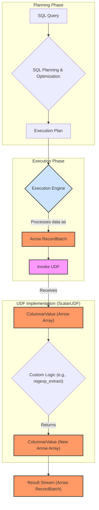

# DataFusion UDF Execution Flow with Arrow

This document explains the high-level data flow within DataFusion when executing a query that involves a User-Defined Function (UDF), highlighting the roles of `ScalarUDF` and Apache Arrow.

## Query Processing Overview

The process is divided into two main phases: **Planning** and **Execution**.

1.  **Planning Phase**: The SQL query is parsed, optimized, and converted into an executable **Execution Plan**.
2.  **Execution Phase**: The physical plan is executed by the engine. Data is processed in columnar batches using Apache Arrow, and the UDF is invoked to perform its custom logic on that data.

## Mermaid Diagram: Data Flow

### Key Components

- **Execution Engine**: The core component that runs the physical plan.
- **ScalarUDF**: The trait that defines our custom function. The engine calls its `invoke()` method during execution.
- **Arrow `RecordBatch`**: The fundamental unit of columnar data that flows through the execution engine.
- **Arrow `Array` / `ColumnarValue`**: The UDF receives its inputs as `ColumnarValue`s (which are backed by Arrow `Array`s) and is expected to return a new `ColumnarValue` containing the result.
